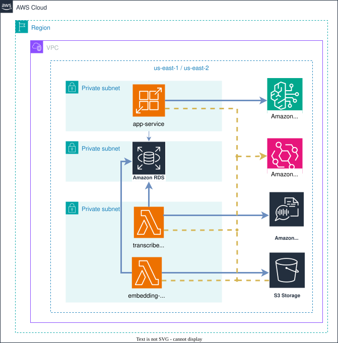

<div align="center">

# Sightline

**Turn thousands of hours of video into searchable, auditable compliance intelligence.**




*Editable source: [docs/Infra.drawio](docs/Infra.drawio) (open with [diagrams.net](https://app.diagrams.net/))*

</div>

Sightline is a cloud-native AI pipeline that ingests long-form video (advisory sessions, earnings calls, training and facility footage), transcribes and indexes it for semantic search, and exposes it to an autonomous query agent that answers natural-language compliance questions with strict, source-verified JSON — no loose prose, no unverifiable claims.

It was designed in direct response to a real-world requirement from a financial-services risk & compliance organization (see [docs/proposal-apex-financial.md](docs/proposal-apex-financial.md)) that needed to replace weeks of manual video review with a system that is fast, cheap per asset, and defensible in an audit.

## Contents

- [Architecture at a glance](#architecture-at-a-glance)
- [What it does](#what-it-does)
- [Documentation](#documentation)
- [Repository layout](#repository-layout)
- [Tech stack](#tech-stack)
- [Local development](#local-development)
- [Status](#status)

## Architecture at a glance

Four logical zones by responsibility, implemented as one VPC with tiered private subnets and Security Groups rather than five peered VPCs (see [infra/README.md](infra/README.md) for why):

| VPC | Responsibility | Key AWS services |
|---|---|---|
| App | Public ingress + analyst UI + query agent — AWS App Runner is directly, publicly accessible on its own domain (see [infra/README.md](infra/README.md) for why there's no gateway or load balancer in front of it) | AWS App Runner (Next.js), Amazon Bedrock |
| Jobs | Ingestion pipeline compute | AWS Lambda (`transcriber-job`, `embedding-job`) |
| AI | Managed AI/ML services | Amazon Transcribe, Amazon S3 Vectors, Amazon Bedrock |
| Storage | System of record | Amazon S3, Amazon RDS, Amazon EventBridge |

Full breakdown, diagrams, and design rationale: [docs/architecture.md](docs/architecture.md).

## What it does

- **Event-driven ingestion** — an uploaded video triggers Amazon Transcribe (speaker-labeled, timestamped transcription); when the transcript is ready, it's automatically embedded and indexed — no polling anywhere in the chain.
- **Semantic indexing** — transcript segments are embedded (Amazon Bedrock) and indexed in Amazon S3 Vectors with filterable metadata, alongside structured metadata in a relational store.
- **Autonomous query agent** — decomposes multi-step natural-language questions ("find every mention of X, return timestamps") into a sequence of tool calls against the semantic index.
- **Strict, auditable output** — every agent response is validated against a JSON schema with video IDs, timestamps, and confidence scores. No schema match, no answer.
- **Predictable cost & reliability** — event-driven, serverless compute with retry/backoff and circuit breakers, so cost scales with actual usage instead of peak capacity.

> **Not yet implemented:** visual-frame sampling and on-screen analysis — see the scope note in [docs/architecture.md](docs/architecture.md). Today's pipeline is transcript-only, by design, to ship a fully working slice first.

## Documentation

| Doc | Contents |
|---|---|
| [docs/architecture.md](docs/architecture.md) | VPC layout, service-by-service responsibilities, trust boundaries |
| [docs/data-flow.md](docs/data-flow.md) | Step-by-step ingestion and query sequence diagrams |
| [docs/agent-orchestration.md](docs/agent-orchestration.md) | How the autonomous query agent decomposes questions, calls tools, and stays grounded |
| [docs/schemas.md](docs/schemas.md) | JSON Schemas for ingestion records and agent responses |
| [docs/cost-and-reliability.md](docs/cost-and-reliability.md) | Cost model, retry logic, circuit breakers, scaling behavior |
| [docs/evaluation-strategy.md](docs/evaluation-strategy.md) | How accuracy is measured and proven over time |
| [docs/local-development.md](docs/local-development.md) | Running the whole pipeline locally with `docker-compose.yml` |
| [docs/proposal-apex-financial.md](docs/proposal-apex-financial.md) | The end-to-end proposal this design responds to |
| [docs/Infra.drawio](docs/Infra.drawio) | Editable source of the architecture diagram above (draw.io) |

## Repository layout

This is a monorepo: each folder under `src/` is an independently deployable unit.

```
docs/                    Architecture, data flow, agent, schema, cost, and evaluation documentation
infra/                   Infrastructure as code (Terraform) -- see infra/README.md
packages/common_py/      Python helpers shared by the Lambda jobs (config, RDS/Secrets Manager access, S3 key convention)
packages/schemas/        Canonical JSON Schemas shared across the monorepo (e.g. the agent's response contract)
src/transcriber-job/     Lambda: starts Transcribe, then parses its output and publishes transcript_ready (Python)
src/embedding-job/       Lambda: embeds transcript segments and writes them to S3 Vectors (Python)
src/app-service/         Analyst UI + query agent API (Next.js/TypeScript, runs on App Runner)
docker/                  Local emulation of the AWS resources above (docker-compose.yml + mocks)
tests/                   Automated test suites
```

## Tech stack

| Layer | Technology |
|---|---|
| Ingestion compute | Python on AWS Lambda — plain zip packages, no container images |
| Analyst UI + query agent | Next.js (TypeScript) on AWS App Runner, publicly accessible directly on its own domain |
| Speech-to-text | Amazon Transcribe |
| Foundation model + embeddings | Amazon Bedrock |
| Semantic / vector search | Amazon S3 Vectors |
| Structured metadata | Amazon RDS (Postgres) |
| Asset storage | Amazon S3 |
| Event backbone | Amazon EventBridge |
| Infrastructure as code | Terraform — single VPC, tiered private subnets, no NAT Gateway (see [infra/README.md](infra/README.md)) |

## Local development

The ingestion side — S3, EventBridge, SQS, RDS, and the two ingestion jobs — runs locally via `docker/docker-compose.yml`, with LocalStack and Postgres standing in for the equivalent AWS services, alongside lightweight mocks for Amazon Transcribe and Amazon Bedrock. `app-service` (the query agent + analyst UI) is now real, AWS-only code with no local fallback (Secrets Manager, Amazon S3 Vectors, Amazon Bedrock directly), so it isn't part of this local stack — see the status note in [docs/local-development.md](docs/local-development.md) for exactly what is and isn't exercisable locally today.

```
docker compose -f docker/docker-compose.yml up -d --build
```

## Status

`transcriber-job` and `embedding-job` are real, functional code — calling Amazon Transcribe, Amazon Bedrock, and Amazon S3 Vectors via boto3, not mocks — deployed to a real AWS account via Terraform. `app-service` (analyst UI + query agent API) is also real, functional code — Secrets-Manager-backed RDS access, Amazon S3 Vectors retrieval, Amazon Bedrock for embeddings and synthesis — but its container image hasn't been pushed to ECR yet, so App Runner still runs AWS's public bootstrap image in the meantime (see [infra/README.md](infra/README.md) for the exact steps to switch it over). The local docker-compose stack (mocks + LocalStack) exists for iterating without an AWS account, but hasn't been re-verified against this layout — see the status note in [docs/local-development.md](docs/local-development.md). Visual-frame sampling is out of scope for now (see [docs/architecture.md](docs/architecture.md)).
