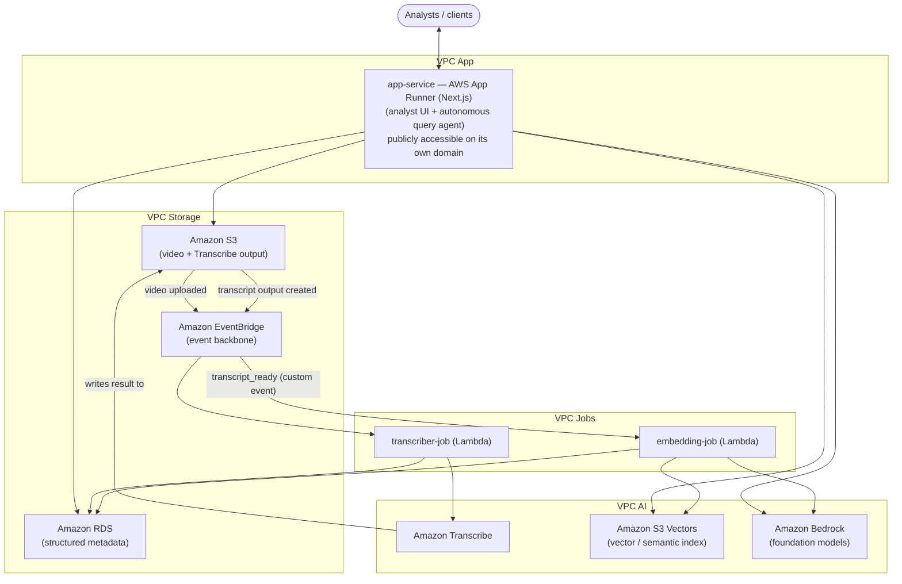

# Architecture

Source diagram: [Infra.drawio](Infra.drawio).

## Design principle: least-privilege network isolation

Sightline processes regulated financial-services content, so the network topology is built around least-privilege isolation rather than convenience. The diagram below groups components into logical zones (App/AI/Jobs/Storage) by responsibility — each zone talks only to the neighbors its data flow requires, and nothing but App is reachable from outside the account.

**Implementation note (network topology):** the Terraform in `infra/` realizes this as **one VPC with tiered private subnets and Security Groups**, not five peered VPCs. Five VPCs would need a peering mesh (or Transit Gateway) just to let App reach Storage and AI, Jobs reach Storage and AI, and Inbound reach App — real infrastructure and cost for isolation that Security Groups already provide within a single workload, which is what AWS's own Well-Architected guidance recommends here. The *isolation the diagram is arguing for* — jobs can't reach the data layer directly, nothing has general internet egress except the query surface itself — is preserved; only the mechanism differs, and the inbound edge itself changed too (see the next note). See [infra/README.md](../infra/README.md) for the actual resource-level decision.

**Implementation note (semantic index):** the diagram shows Amazon OpenSearch Service as the vector/semantic index. The Terraform in `infra/` uses **Amazon S3 Vectors** instead — verified directly against a real AWS account (not just documentation) to support metadata-filtered vector similarity search with sub-second query times, which is what this system actually needs, at a real recurring-cost saving over a running OpenSearch domain. See [cost-and-reliability.md](cost-and-reliability.md) and [infra/s3vectors.tf](../infra/s3vectors.tf).

**Implementation note (ingress):** the diagram draws a separate Inbound VPC fronted by a load balancer, with `app-service` staying private behind it. The Terraform in `infra/` instead makes `app-service` (AWS App Runner) **directly publicly accessible** on its own default HTTPS domain, with no gateway or load balancer in front of it — App Runner already load-balances and autoscales behind that domain. An earlier iteration of this stack put Amazon API Gateway in front of a private App Runner service (via a VPC Ingress Connection), but a plain load balancer can't do the same job: it can route on the `Host` header, not rewrite it, and App Runner's private-ingress PrivateLink endpoint is shared and routes by that header, so a load balancer placed in front of it can't forward correctly. Rather than keep API Gateway's private-integration workaround just to preserve a separate Inbound tier, `app-service` is the one internet-facing compute resource instead. See [infra/README.md](../infra/README.md).

**Implementation note (scope):** there is currently **no visual-frame sampling stage**. The diagram's `observer-job` (scene-change frame sampling for on-screen analysis) was removed to ship the audio/text pipeline — Transcribe → embeddings → semantic search — as a solid, fully working slice first, rather than a wider pipeline that's partially built. This is a real, deliberate gap against the RFP's multi-modal requirement, not a documentation oversight — see the note in [proposal-apex-financial.md](proposal-apex-financial.md).

## VPC-by-VPC breakdown

### VPC App
The query surface, and the only VPC with a public-facing edge. Stateless and horizontally scalable.

| Component | Role |
|---|---|
| `app-service` (AWS App Runner, Next.js) | A single Next.js application: its Route Handlers implement the autonomous query agent described in [agent-orchestration.md](agent-orchestration.md), and its pages are the analyst-facing UI (upload a video, ask a question, see cited results). Publicly accessible directly on App Runner's own HTTPS domain — no gateway or load balancer in front of it, see the ingress implementation note above — it plans multi-step retrieval, calls Bedrock for reasoning/embeddings, reads S3 Vectors and RDS for evidence, and returns schema-validated JSON. No other VPC is reachable from the internet. |

App Runner was chosen over a raw Lambda API for this tier because query sessions are longer-lived and more compute-heavy than ingestion tasks (multi-step tool-calling loops, larger context windows) and benefit from a warm, container-based runtime rather than paying cold-start tax on every reasoning step. Running the UI and the API as one Next.js deployment also means analysts get a working screen without standing up a second service.

### VPC AI
Managed AI services, called only by workloads that need them — never exposed directly to the internet.

| Component | Role |
|---|---|
| Amazon Transcribe | Converts the uploaded video's audio into a timestamped, speaker-labeled transcript, called by `transcriber-job`. |
| Amazon S3 Vectors | Holds vector embeddings for transcript segments with filterable metadata (video ID, timestamp); serves the semantic search step of the query agent, populated by `embedding-job`. No cluster to size — cost and footprint scale with vectors stored, not a running node. |
| Amazon Bedrock | Supplies the foundation model(s) used for embedding generation (`embedding-job`) and for the query agent's reasoning/orchestration loop (`app-service`). |

### VPC Jobs
The ingestion pipeline: two Lambda functions chained by events, not a shared trigger.

| Component | Role |
|---|---|
| `transcriber-job` | Two entry points, both S3-event-triggered (see [data-flow.md](data-flow.md)): starts an Amazon Transcribe job when a video is uploaded, then — invoked again when Transcribe writes its result — parses it into transcript segments, saves them to Amazon RDS, and publishes a `transcript_ready` event. |
| `embedding-job` | Triggered directly by `transcript_ready` (no polling): generates embeddings via Amazon Bedrock for that video's transcript segments and writes them to Amazon S3 Vectors. |

Splitting ingestion into two independent functions, chained by events rather than one invoking the other directly, means a slow or failing step (e.g., Transcribe throttling) is retried/quarantined (its own dead-letter queue) without blocking or duplicating the other's work.

### VPC Storage
The system of record. Nothing outside Jobs, App, and Storage itself can reach these directly.

| Component | Role |
|---|---|
| Amazon S3 | Stores the source video assets and Amazon Transcribe's output. An `ObjectCreated` event on either is what drives the ingestion pipeline forward. |
| Amazon EventBridge | The event backbone for all three hops of the pipeline (video uploaded → transcript output created → transcript ready), decoupling producers from consumers at each step. |
| Amazon RDS | Structured, relational metadata: video registry, transcript segments, and the audit trail the agent cites in its answers. |

## Why this shape satisfies the RFP's requirements

| RFP requirement | How the architecture addresses it |
|---|---|
| Timestamped transcription | `transcriber-job` + Amazon Transcribe, with speaker labels |
| Multi-step natural-language queries across text | The agent in VPC App, orchestrating Bedrock + S3 Vectors + RDS — see [agent-orchestration.md](agent-orchestration.md) |
| No hallucinated or loose answers | Schema-validated responses with source video IDs, timestamps, and confidence — see [schemas.md](schemas.md) |
| Predictable cost, retry/circuit-breaker reliability | Event-driven serverless compute, isolated failure domains per hop (each with its own DLQ) — see [cost-and-reliability.md](cost-and-reliability.md) |
| Ingest without wasting compute on static scenes / visual frame sampling / on-screen summaries | **Not currently implemented** — see the scope note above and [proposal-apex-financial.md](proposal-apex-financial.md) |
