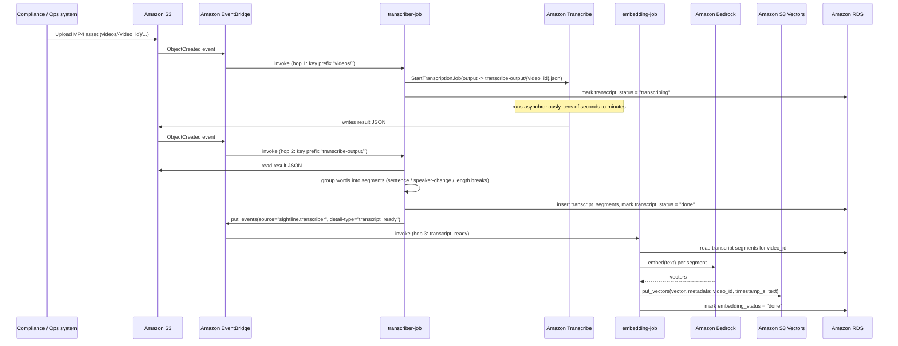

# Data flow

Two independent flows share the same storage layer: **ingestion** (asynchronous, triggered by upload) and **query** (synchronous, triggered by an analyst).

## 1. Ingestion flow

Three EventBridge-driven hops, not a single trigger fanning out — `transcriber-job` runs twice (once per hop it owns), and `embedding-job` is invoked directly by a domain event, not a schedule or a poll:



Notes:

- Each hop has its own EventBridge rule, retry policy, and dead-letter queue (see [cost-and-reliability.md](cost-and-reliability.md)) — a failure in one hop doesn't block or duplicate the others.
- The "videos/" and "transcribe-output/" key prefixes are what let a single Lambda (`transcriber-job`) own both ends of the Transcribe hand-off without the two event patterns matching each other's events.
- `embedding-job` never polls or scans for work: `transcript_ready` carries the exact `video_id` to process, so one event does one video, not a sweep of the whole table.
- A video's status (`transcript_status`: `pending → transcribing → done | failed`; `embedding_status`: `pending → done | failed`) is queryable in RDS at every stage, which is what makes SLA reporting and stuck-job alerting possible.

## 2. Query flow

```mermaid
sequenceDiagram
    participant Analyst
    participant API as app-service (App Runner, Next.js) — query agent
    participant Bedrock as Amazon Bedrock
    participant SV as Amazon S3 Vectors
    participant RDS as Amazon RDS
    participant S3 as Amazon S3

    Analyst->>API: POST /api/query {natural language question} (App Runner's public HTTPS domain)
    API->>Bedrock: decompose question into sub-tasks (planning step)
    loop for each sub-task
        API->>SV: query_vectors(embedding, metadata filter)
        SV-->>API: candidate segments + distance scores
        API->>RDS: resolve segment -> video_id, timestamp, source metadata
        RDS-->>API: structured evidence
    end
    API->>Bedrock: synthesize evidence into schema-constrained answer
    Bedrock-->>API: draft JSON response
    API->>API: validate against JSON Schema (schemas.md); reject/retry on failure
    API-->>Analyst: 200 OK, schema-valid JSON response
```

Notes:

- Every claim in the final answer must trace back to a specific `video_id` + `timestamp` retrieved from RDS/S3 Vectors in an earlier step — the synthesis step is not permitted to introduce evidence it didn't retrieve. See [agent-orchestration.md](agent-orchestration.md) for how this is enforced.
- If schema validation fails, the API retries the synthesis step (bounded retry count) before returning a typed error rather than an unvalidated answer — the system never returns free-form prose to the analyst.
- There is no visual-confirmation step (no sampled frames exist to fetch) — see the scope note in [architecture.md](architecture.md).
